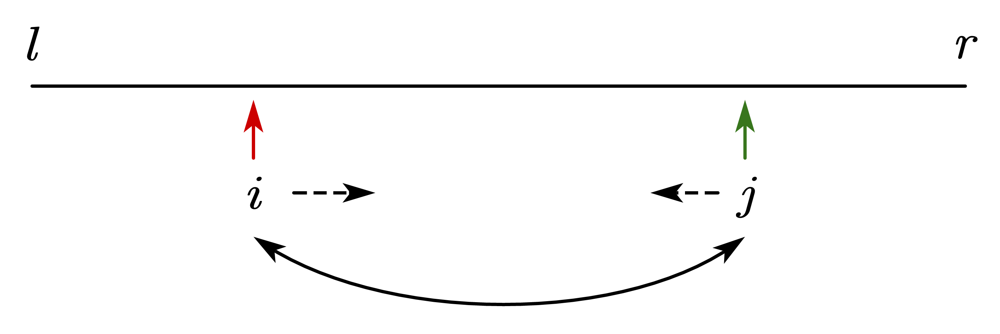
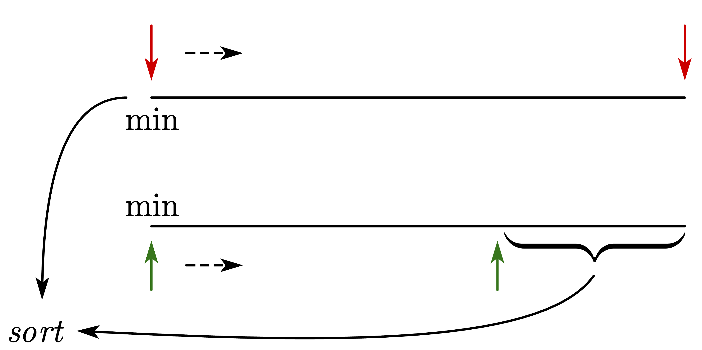

# README

## 第一章：基础算法

### 快速排序

快排的思想：分治

* 确定分界点：$q[l]$, $q[(l+r)/2]$, $q[r]$ 或随机
* 调整区间：确保分界点左边的数2都咸鱼分界点的值，分界点右边的数都大于分界点的值
* 递归处理左右两段



思想：用指针$i$和$j$分别指向数组的左右两端，当$i$指向的数小于分界点的值时，$i$向右移动，直至遇到此时所指的值大于分界点，停止。针对此规则移动$j$，直至$j$所指的值小于分界点。交换$i$与$j$所指的对象，按此规则继续移动。直到$i$与$j$相遇

快排的时间复杂度（平均复杂度）：$O(n\log(n))$，此处为以$2$为底的$\log$，具体推导见归并排序

快排模板：

```c++
#include<iostream>
using namespace std;

const int N = 1e6 + 10;
int n;
int q[N];

void quick_sort(int q[], int l, int r){
    if(l >= r) return; //注意是大于等于
    int x = q[l], i = l - 1, j = r + 1; //1.确定分界点；首先注意中间值取q[l]，递归的时候用j 
    while(i < j){ //2.调整区间
        do i++; while(q[i] < x);
        do j--; while(q[j] > x);
        if(i < j) swap(q[i], q[j]);
    }
    quick_sort(q, l , j); //3.递归处理左右两段；递归的时候两个区间分别为[l, j]和[j + 1, r]
    quick_sort(q, j + 1, r);
}

int main()
{
    scanf("%d", &n);
    for(int i = 0; i < n; i++) scanf("%d", &q[i]);
    quick_sort(q, 0, n - 1);
    for(int i = 0; i < n; i++) printf("%d ", q[i]);
    return 0;
}

```

注意模板中的细节：

* 首先取边界值，直接限定最左边的值为边界值 `x = q[l]` ，和下方的递归区间先对应
* 指针 `i` 与 `j` 分别要向外扩充一个单位
* 递归的时候，注意区间为 `[l, j]`和 `[j + 1, r]`  

### 归并排序

快排是不稳定的，归并排序是稳定的（稳定代表数组中具有相同值的元素，在排序后，其先后顺序不变）

归并的思想：同样是分治

* 首先确定分界点： $mid = (l +r)/2$
* 分界点将数组划分为左右两边，通过递归对左右两边进行排序
* 归并--合二为一  （时间复杂度$O(n)$）



思想：对于排序后的两个数组，利用双指针分别指向当前数组中的最小元素（即最左边的数）。对比两个指针所指数的大小，将较小的数拿出存入排序好的数组$sort$，并将指针向右移动，重复此操作。当某一指针到达数组末尾时，将另一数组指针后的所有元素存入$sort$，完成归并和排序。

归并排序的时间复杂度：$O(n\log(n))$


分析：由于$2^{\log(n)}=n$，即$n$除以$\log(n)$次得到$1$，所以归并排序一共可以划分为$\log(n)$层。每一层的时间复杂度为$O(n)$，例如对第$i$行，其时间复杂度为:
$$
2^{i-1}O(\frac{n}{2^{i-1}})=O(n)
$$
所以总体的时间复杂度为：
$$
\log(n)\times O(n)=O(n\log(n))
$$
快排在划分时不一定为$n/2$，但是其期望是$n/2$，因此快排的平均时间复杂度也为$O(n\log(n))$

归并排序模板:

```c++
#include<iostream>
using namespace std;

const int N = 1e6 + 10;
int n;
int q[N], tmp[N];

void merge_sort(int q[], int l, int r)
{
    if(l >= r) return;
    int mid = l + r >> 1; //1.确定分界点，直接选中点
    merge_sort(q, l, mid); //2.通过递归对分界点左右两段进行排序
    merge_sort(q, mid + 1, r);
    int i = l, j = mid + 1, k = 0;
    while(i <= mid && j <= r) //3. 归并，合二为一
    {
        if(q[i] <= q[j]) tmp[k++] = q[i++];
        else tmp[k++] = q[j++];
    }
    while(i <= mid) tmp[k++] = q[i++];
    while(j <= r) tmp[k++] = q[j++];
    for(int i = l, j = 0; i <= r; i++, j++) q[i] = tmp[j]; //特别注意i与j的初值以及终值
}

int main()
{
    scanf("%d", &n);
    for(int i = 0; i < n; i ++) scanf("%d", &q[i]);
    merge_sort(q, 0, n - 1);
    for(int i = 0; i < n; i ++) printf("%d ", q[i]);
    return 0;
}
```

注意模板中的细节：

* 此时定义的双指针需要与快排的双指针进行区分，归并排序的指针为左右两个数组的初值（最小值）
* 在归并完之后，需要将`tmp[]`数组的值赋给 `q[]`数组，应特别注意赋值时定义的变量 `i`与 `j`的初值和终值
